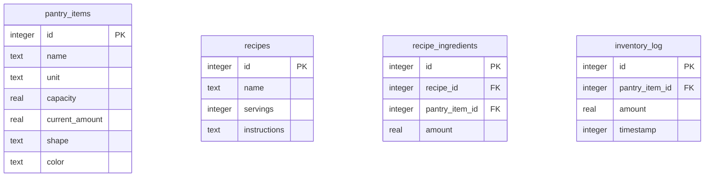

# RationTracker - Expo + React Native Pantry App

A playful, interactive mobile application built using **Expo and React Native** to track home pantry items, configure containers, auto-deduct ingredients after cooking meals, and manage a smart shopping list. It integrates **Gemini 2.5 Flash** for a chatbot-driven recipe builder.

---

## User Review Required

> [!IMPORTANT]
> **API Key Storage & Secure Handling**:
> The Gemini API Key will be stored securely using `expo-secure-store` instead of plain text, ensuring it is encrypted on-device. A settings screen will allow users to input, update, or remove this key.
> 
> **Database & Schema (SQLite)**:
> All structured data (recipes, extensible pantry items, and inventory logs) will be stored in a local SQLite database using `expo-sqlite`.
> 
> **Relational Integrity for Ingredients & Logs**:
> - We will use `pantry_item_id` (integer) as the foreign key in `recipe_ingredients` and `inventory_log`.
> - **Ingredient Name Resolver**: When the Gemini chatbot returns a parsed recipe with ingredients represented as text names (e.g. "Rice", "Atta"), a utility layer in our code will map these names to their respective `pantry_item_id`. It will run a case-insensitive exact match first, followed by a simple fuzzy/partial match fallback. If no match is found, it will warn the user and default to creating a new pantry item or letting them select an existing item in a confirmation modal.
> 
> **Inventory Log & Restock Tracking**:
> To prevent refills/restocks from skewing the rolling average consumption rate, we will log all inventory updates in a single `inventory_log` table:
> - **Deductions (Cooking)**: Logged as a **negative** amount (e.g. `-150.0`).
> - **Restocks (Refills)**: Logged as a **positive** amount (e.g. `+5000.0`).
> - **Manual adjustments**: Logged with a flag or calculated accordingly.
> The consumption rate calculation will strictly average the **negative (deduction)** entries, ignoring positive restocks.
> 
> **Dynamic Restocking Alert Thresholds**:
> We will calculate days remaining for each pantry item:
> - **Rolling Consumption Rate ($R_{\text{daily}}$)**: Sum of deductions (negative values in `inventory_log`) in the last $N$ days (e.g. 14 days) divided by the number of days elapsed.
> - **Transition Policy**:
>   - **Dynamic Mode**: Enabled only if there are **at least 5 logged deductions** AND **at least 5 days have elapsed** since the first logged deduction.
>   - **Static Fallback Mode**: If the conditions above are not met, the app will fallback to static fill percentage thresholds ($< 10\%$ critical/red, $< 25\%$ warning/yellow).
> - **Alert Categories**:
>   - **Critical (Needs Restocked)**: $< 7$ days remaining (or $< 10\%$ in static fallback).
>   - **Warning (Almost Finished)**: $7$ to $14$ days remaining (or $10\% \text{ to } 25\%$ in static fallback).
> 
> **Add New Pantry Item Flow**:
> To ensure the app is fully extensible, users can add new custom pantry items (e.g., Sugar, Salt) in two places:
> 1. **Onboarding**: A step in the setup flow.
> 2. **HomeScreen**: A dedicated "+ Add New Item" card will sit at the end of the pantry items list. Tapping this card will launch a modal prompting the user to name the item, choose its unit (g, ml, count), container shape, maximum capacity, and starting amount.

---

## Scope & Core Constraints

1. **Local-Only Storage**: All data (SQLite database and SecureStore configuration) will be stored strictly on-device. If the user uninstalls the app or resets their phone, the data is lost. No cloud sync is planned for this version.
2. **AI Engine**: Gemini 2.5 Flash will be utilized solely for parsing and structuring user descriptions into recipes via the chatbot. All other inventory, shopping list generation, and alerts are driven by non-generative relational query algorithms.

---

## Proposed Changes

We will create a clean React Native codebase under the `c:/Coding/RationTracker` directory. The structure of the application will look as follows:

```
c:/Coding/RationTracker/
├── assets/                    # App assets (icons, splash screen)
├── src/
│   ├── components/            # Reusable UI components
│   │   ├── ContainerVisualizer.tsx  # Dynamic SVG container (Jar, Bag, Bottle)
│   │   ├── ChatBot.tsx        # Chatbot UI with Gemini API integration
│   │   └── ThemeContext.tsx   # Light/Dark mode context
│   ├── database/              # SQLite database manager
│   │   └── schema.ts          # Database open, migration, seed, and queries helper
│   ├── screens/               # Screens for Navigation
│   │   ├── OnboardingScreen.tsx # Screen for container setup (shape & size)
│   │   ├── HomeScreen.tsx     # Pantry overview (levels, fill animations, cook button, add item card)
│   │   ├── RecipesScreen.tsx  # Recipe list & Chatbot integration to add new ones
│   │   ├── ShoppingScreen.tsx # Shopping list manager & sharing options
│   │   └── SettingsScreen.tsx # Light/Dark mode and Gemini API Key configuration
│   ├── hooks/
│   │   └── useDatabase.ts     # Hook / Context to access SQLite database and reload data
│   ├── utils/
│   │   ├── gemini.ts          # API calling logic for Gemini 2.5 Flash with responseSchema
│   │   └── recommendations.ts # Rolling consumption rate calculations
│   └── theme/
│       └── colors.ts          # Playful light/dark color definitions
├── App.tsx                    # Main App entrypoint
├── app.json                   # Expo config (expo-sqlite & expo-secure-store config)
├── package.json               # Dependencies
└── tsconfig.json              # TypeScript setup
```

### Database Schema Design (`schema.ts`)
We will initialize the SQLite database using `expo-sqlite`. The database tables will be structured as follows:



---

## Verification Plan

### Automated Tests
- Verification of the rolling consumption restocking logic with mock database records.
- TypeScript compiler verification.

### Manual Verification
- **Onboarding Flow**: Configure shapes/capacities and check DB population.
- **SecureStore API Key Check**: Enter, reload, and verify that the API key persists and is used securely.
- **Chatbot Flow**: Send recipe instructions to the Gemini bot, verify that the structured JSON schema response is correctly retrieved and mapped to `recipes` and `recipe_ingredients`.
- **Relationship Queries**: Verify search filter e.g., "Recipes using Atta".
- **Dynamic Alerts**: Simulate old cook history records (e.g. 5 days ago, 2 days ago) to verify that warning/critical labels shift from default percentages to day-remaining estimates.
- **Sharing**: Verify plain text list sharing.
